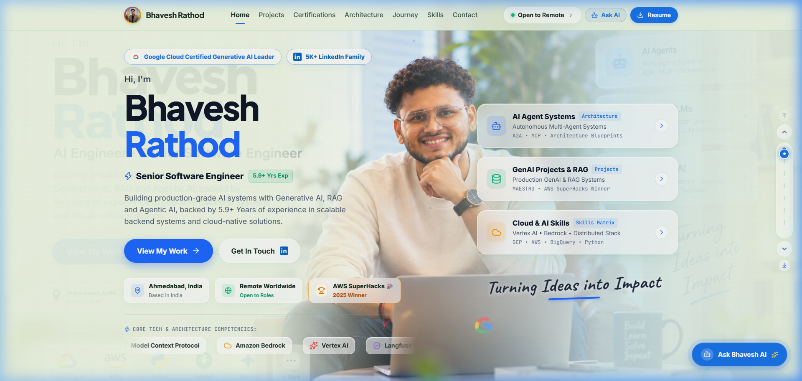

# Bhavesh Rathod — Personal Portfolio & AI Systems Showcase

[](https://bhavesh-rathod.vercel.app/)
[](https://www.linkedin.com/in/bhaveshkumar-rathod/)
[](https://github.com/br-bit3194)
[](https://react.dev)
[](https://vitejs.dev)

---

## 📸 Live Portfolio Preview



---

## 🚀 The Story Behind This Project

> ### 🚀 𝗦𝗼𝗺𝗲𝘁𝗵𝗶𝗻𝗴 𝗽𝗲𝗿𝘀𝗼𝗻𝗮𝗹 𝗜’𝘃𝗲 𝗯𝗲𝗲𝗻 𝗯𝘂𝗶𝗹𝗱𝗶𝗻𝗴 𝗶𝘀 𝗳𝗶𝗻𝗮𝗹𝗹𝘆 𝗹𝗶𝘃𝗲.
> **My first personal portfolio.** 🎉  
> 🔗 **[https://bhavesh-rathod.vercel.app/](https://bhavesh-rathod.vercel.app/)** • **[Read on LinkedIn](https://www.linkedin.com/posts/bhaveshkumar-rathod_ai-generativeai-agenticai-ugcPost-7511479848708685825-J7cL/)**
>
> *I’ve spent years building software for products and teams, but I’d never built a website that was completely my own.*  
> *So I decided to give it a try.*  
> 
> *I wanted more than a page with my resume and skills. I wanted to tell the story of what I’ve built, what I’ve learned, and how my journey has evolved.*  
> *And honestly, building it for the first time was a lot of fun.*  
>
> - 🎨 **ChatGPT** helped me explore the initial visual and landing-page concepts.
> - ⚡ **Antigravity** helped turn those ideas into a real website.
> - 🧠 The rest was my creativity, engineering, and plenty of iterations.
> - ☁️ And finally, **Vercel** brought it online.
>
> *It now brings together my work across GenAI, RAG, Agentic AI, A2A, MCP, cloud architecture, and backend engineering, along with an interactive view of my career journey.*

---

## 🌟 Key Highlights & Architectural Features

- ⚡ **2-Second Recruiter Impression**: Minimalist executive layout inspired by *21st.dev*, *Aceternity UI*, and tailored Google/Jade Sky design tokens.
- 🏆 **AWS SuperHacks 2025 Special Jury Award Winner**: Dedicated interactive spotlight and embedded video demonstration for **MAESTRO** (Autonomous Multi-Agent IT Operations Platform).
- 🧩 **Interactive System Architecture Blueprints**: Interactive flow diagrams with live node inspector for Multi-Agent A2A/MCP orchestration, Google Vertex AI pipelines, and high-concurrency FinTech data engines.
- 🎮 **Gamified Career Progression**: Level-by-level RPG Questline exploring 5.9+ years of engineering mastery with unlocked power stats and auto-tour narration.
- 🤖 **Interactive AI Assistant ("Ask Bhavesh AI")**: Embedded RAG chatbot synthesizing verified accomplishments, 94% backend optimizations, and direct GitHub/YouTube citations.
- 📱 **100% Fluid Mobile & High-DPI Experience**: Dedicated high-resolution passport-size headshot on mobile with zero background clutter and responsive touch navigation.

---

## 🛠️ How We Built This: Step-by-Step Blueprint for Others

Want to build a next-generation engineering portfolio like this? Here is the exact methodology:

```
┌─────────────────┐       ┌─────────────────┐       ┌─────────────────┐       ┌─────────────────┐
│   1. Ideation   │ ───►  │  2. Engineering │ ───►  │  3. Polish &    │ ───►  │  4. Automated   │
│    (ChatGPT)    │       │  (Antigravity)  │       │   Responsive    │       │   CI/CD Deploy  │
└─────────────────┘       └─────────────────┘       └─────────────────┘       └─────────────────┘
  Visual Concepts           React 19 + Vite           Fluid Mobile Scaling        Vercel Global Edge
  Copy & Structure          21st.dev Micro-Interactions High-Res Assets           Single Page App
```

### Step 1: Conceptualize & Storyboard (with ChatGPT)
- Define your narrative: Go beyond a standard resume; structure sections into **Core Impact**, **Featured Hackathon Wins**, **System Architecture Blueprints**, and an **Interactive Career Journey**.
- Explore tailored color palettes: Use curated harmonious schemes (e.g., Light Frosted Sage / Jade Sky with Google blue, emerald, amber, and coral accents).

### Step 2: Autonomous Pair-Programming (with Antigravity AI)
- Initialize a lightning-fast modern stack using **React 19** and **Vite**.
- Build reusable UI primitives inspired by *21st.dev* and *Magic UI*:
  - **ParticleCanvas**: GPU-accelerated interactive constellation canvas.
  - **SpotlightCard & 3D Tilt**: Subtle cursor spotlight and parallax tilt effects.
  - **Magnetic Buttons**: Spring physics attraction on hover.
  - **Infinite Marquee**: Smooth infinite tech stack marquee.

### Step 3: Decouple Data from Presentation
- Store all profile details, metric stats, skills, projects, and career history inside a single source of truth: [`src/data/portfolioData.js`](src/data/portfolioData.js).
- This allows instant 30-second portfolio updates without touching component code.

### Step 4: Build Embedded AI Intelligence
- Implement an in-browser Assistant Modal with local RAG keyword matching for instant sub-second answers and pluggable Google Gemini 1.5 Flash API integration.

### Step 5: Responsive Precision & Retina Asset Optimization
- Ensure zero horizontal scroll on mobile ($360\text{px}-1024\text{px}+$ viewports).
- Use fluid `clamp()` typography and CSS grid auto-fit columns.
- Serve crisp master crops (e.g. `public/passport_photo.png`) supersampled with Lanczos filtering.

### Step 6: Deploy with Zero Friction on Vercel
- Connect the GitHub repository directly to Vercel.
- Configure `vercel.json` for SPA routing and automatic global edge deployment on every `git push`.

---

## 💻 Tech Stack & Dependencies

| Layer | Technologies Used |
| :--- | :--- |
| **Core Framework** | React 19, Vite 8 |
| **Styling & Tokens** | Pure Vanilla CSS Design Tokens, Jade Sky Bloom Gradients |
| **Motion & Physics** | Framer Motion, Canvas Confetti, React Parallax Tilt |
| **Icons & Media** | Lucide React, Custom Brand SVG Logos |
| **Deployment** | Vercel (Edge Network) |

---

## 🚀 Running Locally

```bash
# 1. Clone the repository
git clone https://github.com/br-bit3194/my-portfolio.git
cd my-portfolio

# 2. Install dependencies
npm install

# 3. Start local development server
npm run dev

# 4. Build for production
npm run build
```

---

## 🔮 Decoupled Data Model (How to Update in 30 Seconds)

To update your portfolio, edit [`src/data/portfolioData.js`](src/data/portfolioData.js):

| To Update | File & Property to Edit |
| :--- | :--- |
| **New Job / Role / Promotion** | Add an entry inside `experience: [ ... ]` |
| **New Skills / Tech Stack** | Add skills in `skills.categories: [ ... ]` |
| **New Hackathon / Project** | Add a project object in `projects: [ ... ]` |
| **New Certifications** | Add an entry in `certifications: [ ... ]` |
| **Resume PDF** | Replace `public/Bhavesh_Rathod_GenAI_Engineer_Resume.pdf` |
| **Profile Photo** | Replace `public/passport_photo.png` or `public/photo.jpeg` |

---

## 👤 Author & Connect

**Bhaveshkumar (Bhavesh) Rathod**  
*Senior Backend Engineer & GenAI Architect*

- 🌐 **Live Portfolio:** [https://bhavesh-rathod.vercel.app/](https://bhavesh-rathod.vercel.app/)
- 💼 **LinkedIn:** [linkedin.com/in/bhaveshkumar-rathod](https://www.linkedin.com/in/bhaveshkumar-rathod/)
- 💻 **GitHub:** [github.com/br-bit3194](https://github.com/br-bit3194)
- ✉️ **Email:** [bhavesh3194@gmail.com](mailto:bhavesh3194@gmail.com)
